# Using AWS CDK to build EC2 with enclave option Enable
This repo demonstrates using AWS CDK to create an EC2 with enclave options. After that, we can use an enclave for security.

Read the document for information:

https://aws.amazon.com/vi/ec2/nitro/nitro-enclaves/
https://docs.aws.amazon.com/enclaves/latest/user/nitro-enclave.html
https://docs.aws.amazon.com/enclaves/latest/user/getting-started.html

## Prerequisites
1. Need Node.js 14.15.0 or later.

2. Install TypeScript
> npm i -g typescript

3. Enable & set Identity Management Center for AWS SSO:  https://aws.amazon.com/iam/identity-center/

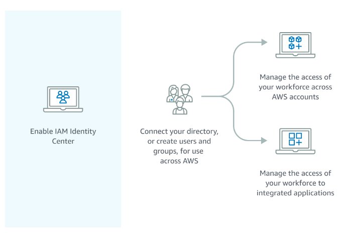

4. Account have permission to deploy

5. Using `aws configure sso` to configure the login account

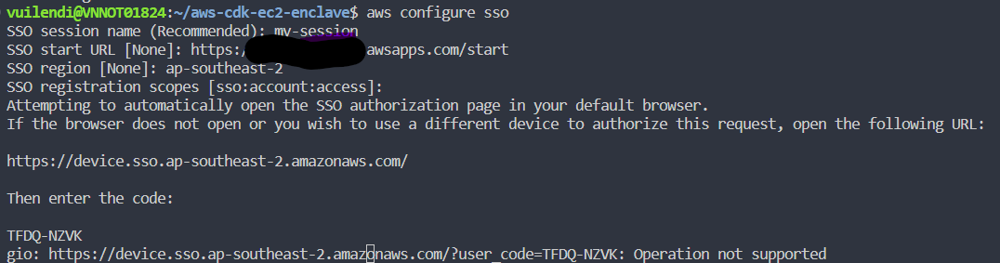

After logging in to the web browser, we continue to input information.

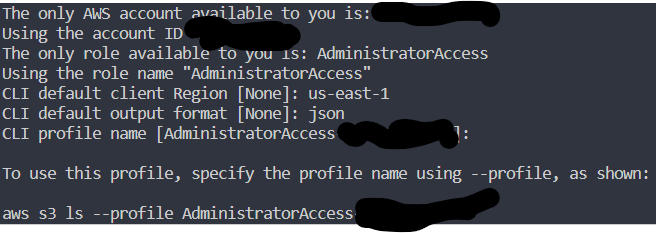

6. Replace key pair with your key pair 

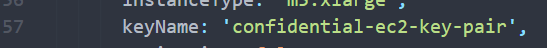

## Code - Build and Run
Using CDK to build infra in AWS, we can use three construct levels:
- L1 constructs (low-level construct): we call **CFN Resources**. These constructs directly represent all resources available in AWS CloudFormation.

- L2 constructs (AWS Resources, but with higher level, intent-based API). AWS constructs offer convenient defaults and reduce the need to know all the details about the AWS resources they represent

- L3 constructs (patterns): These constructs are designed to help you complete common tasks in AWS, often involving multiple kinds of resources.

We should use L2 constructs for ease. But in L2, we currently don't have an `enclave option,` so we will combine L1 and L2.

## Steps by Steps

- (Optional) Build code to check error
> npm run build

- Login to AWS Account
> aws sso login

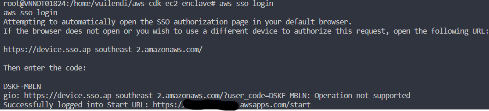

- Generate AWS CloudFormation template
> cdk synth

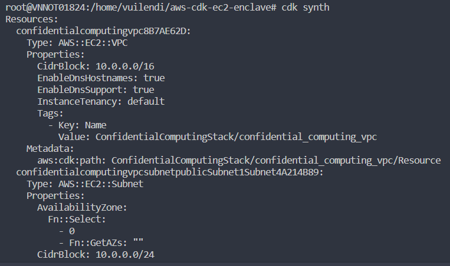

- Deploy to AWS
> cdk deploy

CloudFormation Stack
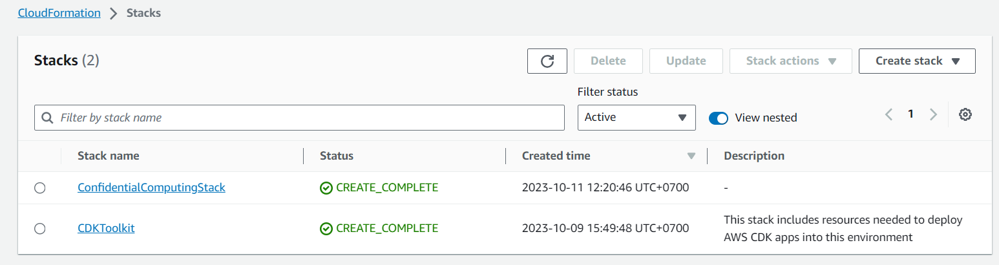

EC2 Instance
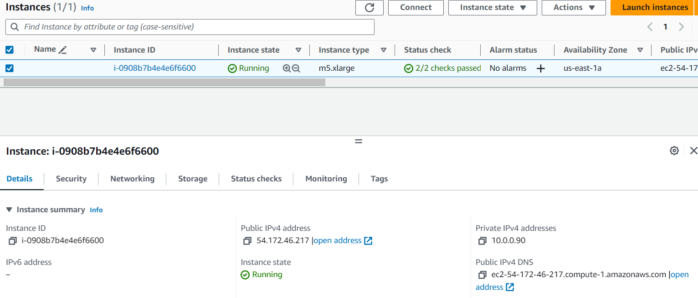

- Using `SSH` to connect to EC2 for testing
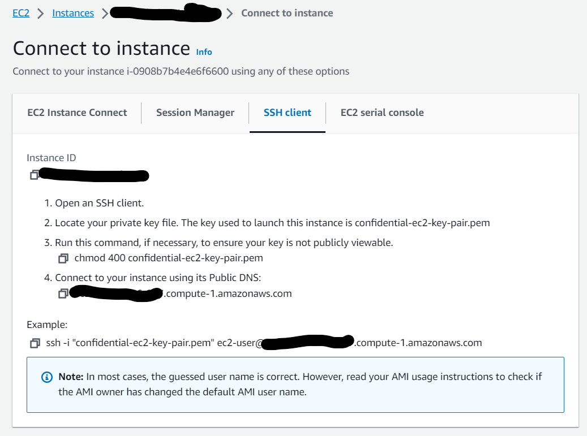

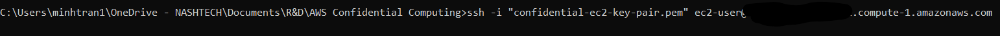

- Run following command to build enclave
```
nitro-cli build-enclave --docker-uri hello:latest --output-file hello.eif

nitro-cli run-enclave --cpu-count 2 --memory 512 --enclave-cid 16 --eif-path hello.eif --debug-mode

```

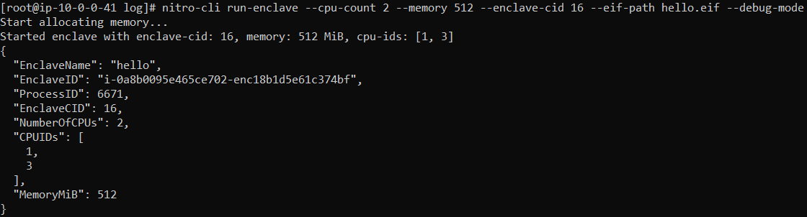

- Check result from console
> nitro-cli console --enclave-id i-0a8b0095e465ce702-enc18b1d5e61c374bf

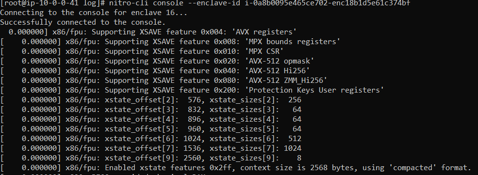

- (Optional) Destroy all AWS Resources after testing
> cdk destroy
