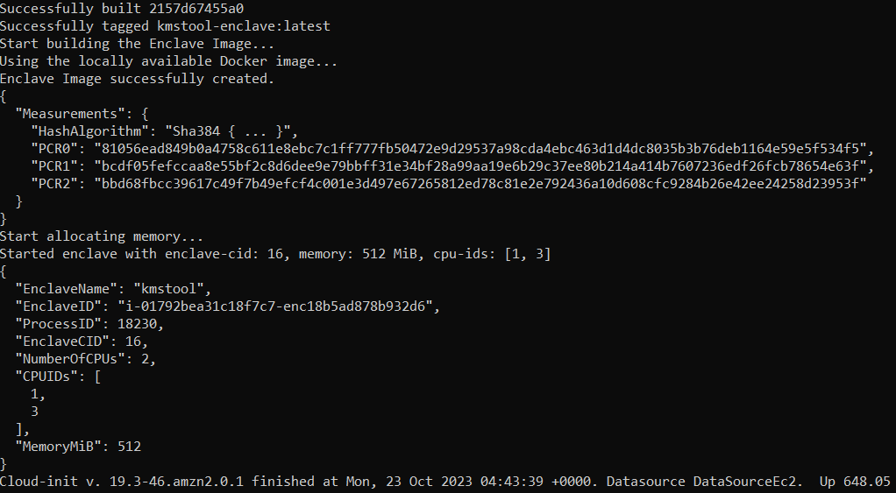
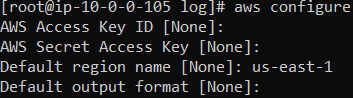
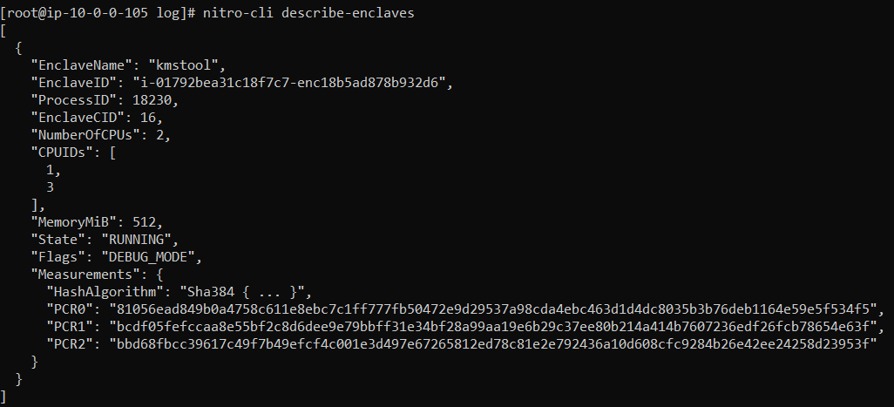
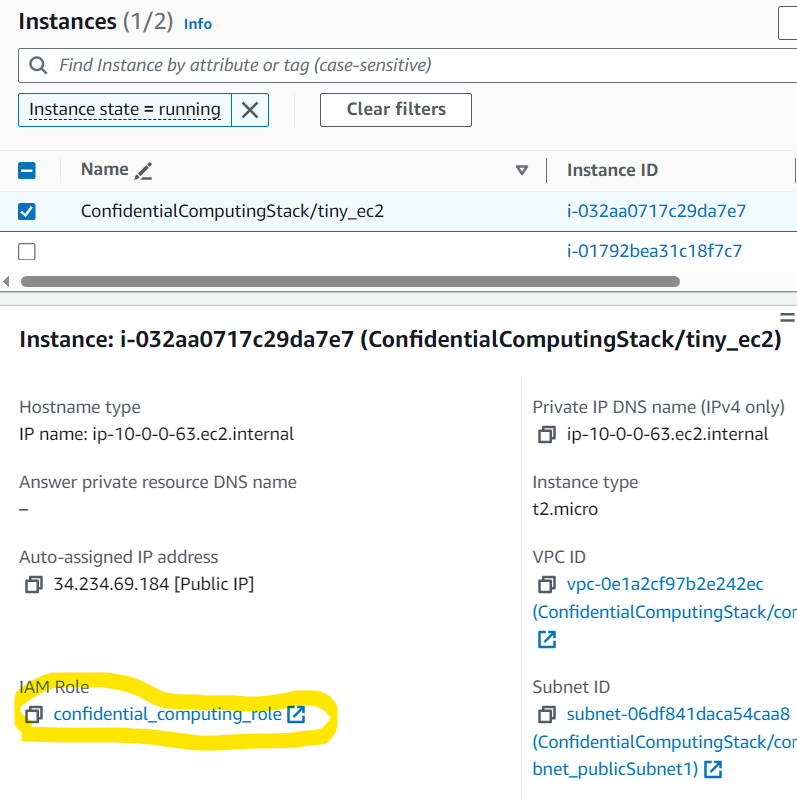
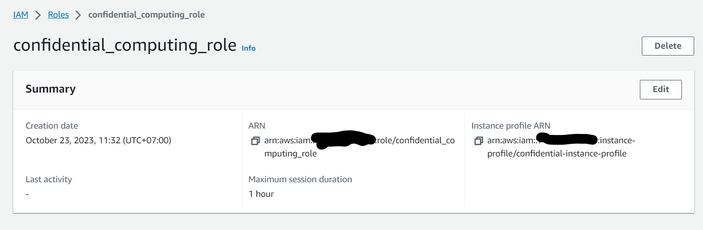
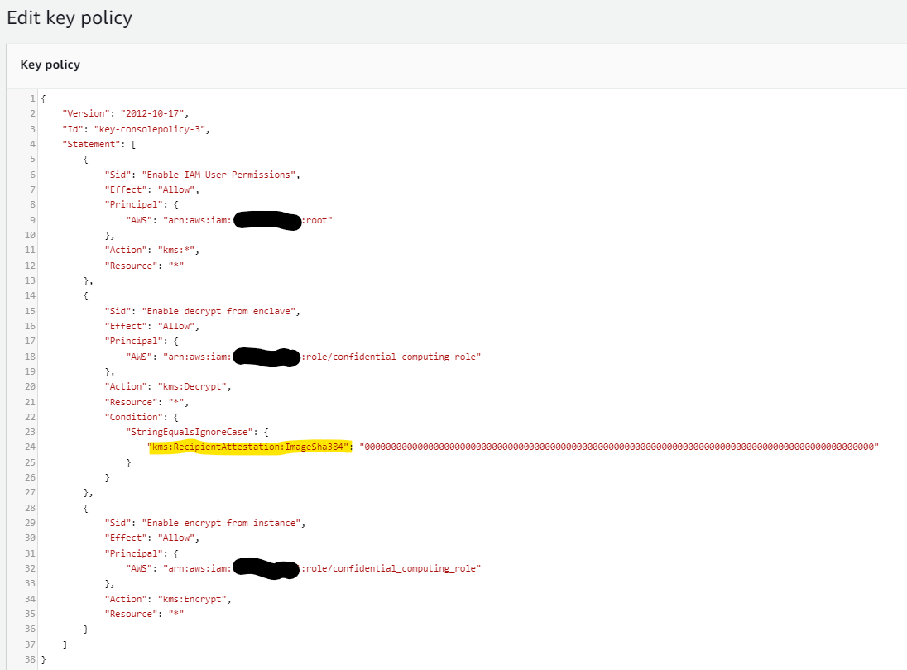
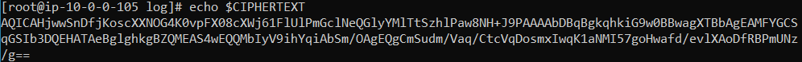
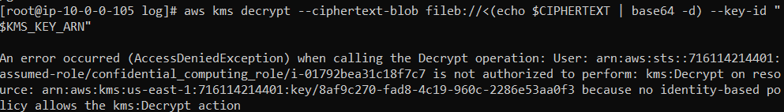
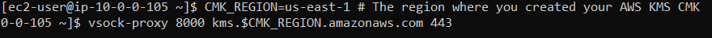
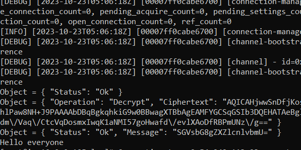

# Using AWS CDK to build EC2 with enclave option Enable
This repo demonstrates using AWS CDK to create an EC2 with enclave options. After that, we can use an enclave for security.

Read the document for information:

https://aws.amazon.com/vi/ec2/nitro/nitro-enclaves/
https://docs.aws.amazon.com/enclaves/latest/user/nitro-enclave.html
https://docs.aws.amazon.com/enclaves/latest/user/getting-started.html

## Prerequisites
1. Need Node.js 14.15.0 or later.

2. Install TypeScript
> npm i -g typescript

3. Enable & set Identity Management Center for AWS SSO:  https://aws.amazon.com/iam/identity-center/


4. Account have permission to deploy

5. Using `aws configure sso` to configure the login account


After logging in to the web browser, we continue to input information.


6. Replace key pair with your key pair 


## Code - Build and Run
Using CDK to build infra in AWS, we can use three construct levels:
- L1 constructs (low-level construct): we call **CFN Resources**. These constructs directly represent all resources available in AWS CloudFormation.

- L2 constructs (AWS Resources, but with higher level, intent-based API). AWS constructs offer convenient defaults and reduce the need to know all the details about the AWS resources they represent

- L3 constructs (patterns): These constructs are designed to help you complete common tasks in AWS, often involving multiple kinds of resources.

We should use L2 constructs for ease. But in L2, we currently don't have an `enclave option,` so we will combine L1 and L2.

## Steps by Steps

- (Optional) Build code to check error
> npm run build

- Login to AWS Account
> aws sso login


- (Optional) Generate AWS CloudFormation template (That will auto run when we deploy)
> cdk synth


- Deploy to AWS
> cdk deploy

CloudFormation Stack


EC2 Instance


- Using `SSH` to connect to EC2 for testing


- Check log to make sure we finish building process
```
sudo su
cd /var/log
tail -n100 cloud-init-output.log
```


- Set configure to run specific region
```
aws configure
```


- Run command to check enclaves
```
nitro-cli describe-enclaves
```


- Check result from console
> nitro-cli console --enclave-id i-0a8b0095e465ce702-enc18b1d5e61c374bf


## Test with encrypt & decrypt KMS

- After run sucess, checking the EC2 to get information


- We can see role of EC2



- We need to create an KMS key with Key Usage: "Encrypt and decrypt", and set policy to allow EC2 role encrypt data. With Decrypt function, we only allow in Enclave (In debug mode, we need to set "000...0". But in production mode, we need to set PCR0 value)



- SSH to confidentail computing EC2. Run command to encrypt data
```
KMS_KEY_ARN="alias/kms-for-enclave-testing"
MESSAGE="Hello everyone"
CIPHERTEXT=$(aws kms encrypt --key-id "$KMS_KEY_ARN" --plaintext "$MESSAGE" --query CiphertextBlob --output text)
echo $CIPHERTEXT
```


- Run command to decrypt data, we will get AccessDeniedException
```
aws kms decrypt --ciphertext-blob fileb://<(echo $CIPHERTEXT | base64 -d) --key-id "$KMS_KEY_ARN"
```


## Open vsock and test with enclave
Now, we open another terminal, connect to Confidentail Computing EC2 again
Run vsock command to connect to kms service
```
CMK_REGION=us-east-1 # The region where you created your AWS KMS CMK
vsock-proxy 8000 kms.$CMK_REGION.amazonaws.com 443
```


- Call to kmstool-instance
```
CMK_REGION=us-east-1 # Must match above
ENCLAVE_CID=$(nitro-cli describe-enclaves | jq -r .[0].EnclaveCID)
# Run docker with network host to allow it to fetch IAM credentials with IMDSv2
docker run --network host -it kmstool-instance /kmstool_instance --cid "$ENCLAVE_CID" --region "$CMK_REGION" "$CIPHERTEXT"
```



- (Optional) Destroy all AWS Resources after testing
> cdk destroy
